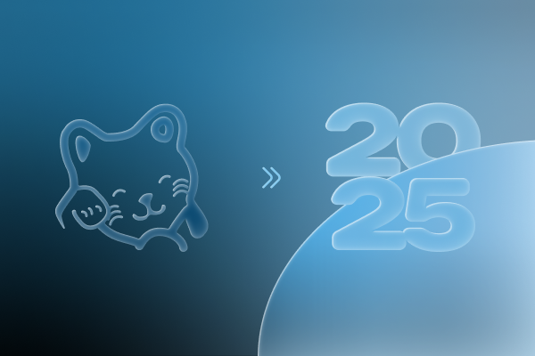
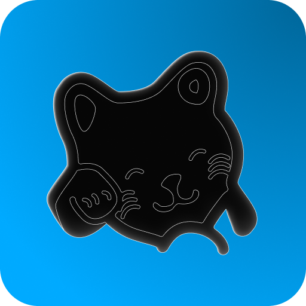
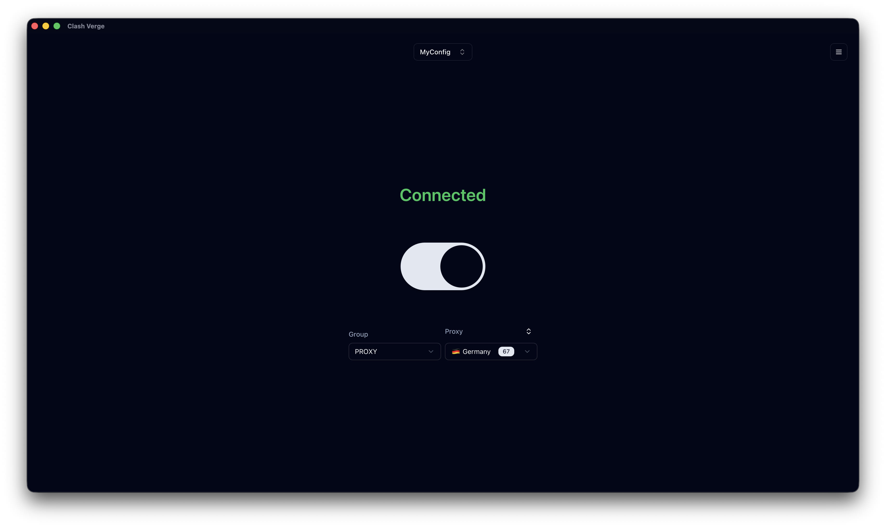
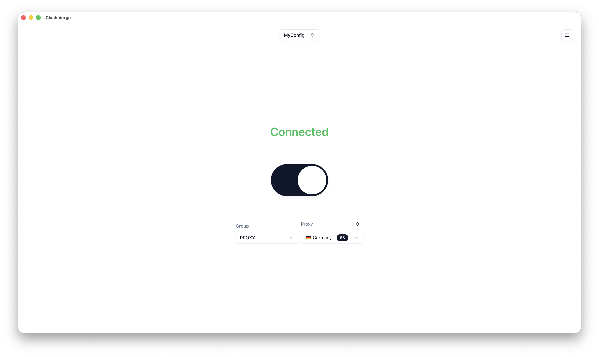

<div align="center">
  
  
  
  <h1>
    
    Kitsura VPN
  </h1>
  
  <p>
    <strong>A modern VPN client built with Rust & <a href="https://github.com/tauri-apps/tauri">Tauri</a></strong><br>
    Fork of <a href="https://github.com/clash-verge-rev/clash-verge-rev">Clash Verge Rev</a>
  </p>
  
  <p>
    <a href="https://github.com/catoo-hub/kitsura-vpn/releases">
      
    </a>
    <a href="https://github.com/catoo-hub/kitsura-vpn/blob/main/LICENSE">
      
    </a>
    <a href="https://github.com/catoo-hub/kitsura-vpn/stargazers">
      
    </a>
  </p>
  
</div>

---

## 🌟 About Kitsura VPN

**Kitsura VPN** is a powerful, cross-platform VPN client that combines the robustness of Rust with the elegance of modern web technologies. Built on the reliable foundation of Clash Verge Rev, it offers a seamless VPN experience with advanced features and beautiful user interface.

### ✨ Key Highlights

- 🚀 **Lightning Fast**: Built with Rust for maximum performance
- 🎨 **Beautiful UI**: Modern interface with dark/light themes
- 🌍 **Cross-Platform**: Windows, Linux, and macOS support
- 🔒 **Secure**: Advanced encryption and privacy protection
- 🛡️ **Reliable**: Based on proven Clash Meta technology

## 📸 Preview

<div align="center">
  
| 🌙 Dark Theme | ☀️ Light Theme |
| :---: | :---: |
|  |  |

_Experience Kitsura VPN in both elegant dark and clean light themes_

</div>

## 📥 Installation

<div align="center">

### 🚀 Quick Download

<a href="https://github.com/catoo-hub/kitsura-vpn/releases/latest">
  
</a>

</div>

### 💻 Supported Platforms

| Platform       | Architecture         | Status          |
| -------------- | -------------------- | --------------- |
| 🪟 **Windows** | x64, ARM64           | ✅ Full Support |
| 🐧 **Linux**   | x64, ARM64           | ⌛ Soon         |
| 🍎 **macOS**   | Intel, Apple Silicon | ⌛ Soon         |

> **Note**: Windows 7 is no longer supported. Please use Windows 10 or later.

### 📱 Stay Updated

**Telegram Channel**: [Join our community](https://t.me/kitsuravpn)

---

## 🎯 Features

<div align="center">

### 🛠️ Core Technology

</div>

- **🦀 Rust Foundation**: Built on the powerful Rust framework for maximum performance and safety
- **⚡ Tauri 2**: Leveraging the latest Tauri 2 framework for modern desktop applications
- **🔥 Clash Meta**: Integrated [Clash.Meta (mihomo)](https://github.com/MetaCubeX/mihomo) kernel with alpha version support

<div align="center">

### 🎨 User Experience

</div>

- **🌈 Beautiful Interface**: Clean, intuitive UI with customizable theme colors
- **🎭 Dual Themes**: Elegant dark mode and clean light mode
- **🎨 CSS Injection**: Advanced customization with CSS injection supports

<div align="center">

### 🔧 Advanced Features

</div>

- **📁 Config Management**: Smart configuration file management with syntax highlighting
- **🛡️ System Integration**: System proxy and guard with TUN (Virtual NIC) mode
- **✏️ Visual Editing**: Intuitive node and rule editing interface
- **☁️ WebDAV Sync**: Configuration backup and synchronization via WebDAV

<div align="center">

### 🌐 Multi-Language Support

</div>

- **🗣️ 13 Languages**: English, Russian, Chinese, Japanese, Korean, and more
- **🌍 Global Ready**: Internationalized interface for worldwide users

## 🛠️ Development

<div align="center">

### 🚀 Quick Start

</div>

Ready to contribute? See [CONTRIBUTING.md](./CONTRIBUTING.md) for detailed development guidelines.

### 📋 Prerequisites

- **Node.js** 18+ and **pnpm**
- **Rust** 1.70+ toolchain
- **Tauri** development environment

### 🔨 Build & Run

```bash
# Install dependencies
pnpm install

# Check project health
pnpm run check

# Start development server
pnpm dev

# Build for production
pnpm build
```

### 🎯 Development Commands

```bash
# Version management
pnpm run release-version <version>  # Update version across all files
pnpm run sync-version              # Sync versions between files

# Testing & Quality
pnpm run check                     # Run all checks
pnpm run lint                      # Lint code
pnpm run format                    # Format code

# Platform specific builds
pnpm run build:windows            # Windows build
pnpm run build:linux              # Linux build
pnpm run build:macos              # macOS build
```

## 🤝 Contributing

<div align="center">

### 💝 We Love Contributors!

Your contributions make **Kitsura VPN** better for everyone.

</div>

**🌟 Ways to Contribute:**

- 🐛 **Report bugs** and suggest improvements
- 💡 **Feature requests** and ideas
- 🌍 **Translations** to new languages
- 📝 **Documentation** improvements
- 🔧 **Code contributions** and bug fixes

**📖 Getting Started:**

1. Read our [Contributing Guide](./CONTRIBUTING.md) for detailed guidelines
2. Check [existing issues](https://github.com/catoo-hub/kitsura-vpn/issues) or create a new one
3. Fork the repository and create your feature branch
4. Submit a pull request with clear description

<div align="center">

**🚀 Ready to contribute?** • **📖 Read [CONTRIBUTING.md](./CONTRIBUTING.md)**

</div>

## Acknowledgement

Clash Verge rev was based on or inspired by these projects and so on:

- [zzzgydi/clash-verge](https://github.com/zzzgydi/clash-verge): A Clash GUI based on tauri. Supports Windows, macOS and Linux.
- [tauri-apps/tauri](https://github.com/tauri-apps/tauri): Build smaller, faster, and more secure desktop applications with a web frontend.
- [Dreamacro/clash](https://github.com/Dreamacro/clash): A rule-based tunnel in Go.
- [MetaCubeX/mihomo](https://github.com/MetaCubeX/mihomo): A rule-based tunnel in Go.
- [Fndroid/clash_for_windows_pkg](https://github.com/Fndroid/clash_for_windows_pkg): A Windows/macOS GUI based on Clash.
- [vitejs/vite](https://github.com/vitejs/vite): Next generation frontend tooling. It's fast!

## License

## 📄 License

<div align="center">

### 🛡️ Open Source & Free

**Kitsura VPN** is released under the **GPL-3.0 License**

_Building privacy tools for everyone, everywhere_

---

<div align="center">
  
  <strong>Made with ❤️ by the Kitsura Team</strong>
</div>

**🌟 Star us on GitHub** • **🐛 Report Issues** • **💬 Join Discussions**

</div>
